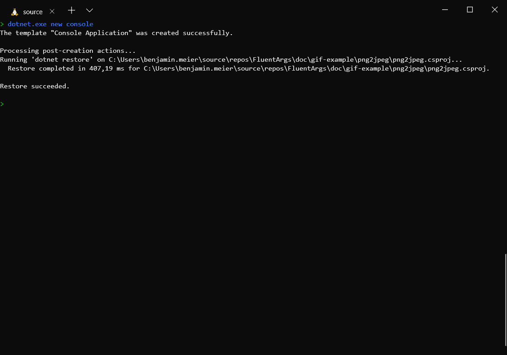

[](https://dev.azure.com/benjaminmeier70/PipelinePlayground/_build/latest?definitionId=3&branchName=master)

# FluentArgs: Fluent Argument Parsing for .NET
<strong>
Version:
0.9.1

</strong>

FluentArgs is an easy-to-use library that provides command line argument parsing. For all parameters it is possible
to provide meta information (description, examples etc.) which might be used to auto-generate a simple help for the
final application.

# Why FluentArgs?

The API is optimized to be as readable and type-safe as possible. Therefore, anyone can learn how to use this library
in just a few minutes.



# How to install
Package Manager:
```
PM> Install-Package FluentArgs
```

.NET CLI:
```
> dotnet add package FluentArgs
```

Paket CLI:
```
> paket add FluentArgs
```

# 💡 Example: Parse simple arguments and flags
Given you want a program which supports png to jpeg conversion and you want to support calls like these:
- `myapp -i image.png -o image.jpeg -q 100`
- `myapp --input image.png --quality 50 --output image.jpeg`
- `myapp --input=image.png -q=50 --output image.jpeg`
- etc.

There's the code:
```csharp
namespace Example
{
    using System;
    using System.Threading.Tasks;
    using FluentArgs;

    public static class Program
    {
        public static void Main(string[] args)
        {
            FluentArgsBuilder.New()
                .Parameter("-i", "--input").IsRequired()
                .Parameter("-o", "--output").IsRequired()
                .Parameter<ushort>("-q", "--quality")
                    .WithValidation(n => n >= 0 && n <= 100)
                    .IsOptionalWithDefault(50)
                .Call(quality => outputFile => inputFile =>
                {
                    /* ... */
                    Console.WriteLine($"Convert {inputFile} to {outputFile} with quality {quality}...");
                    /* ... */
                })
                .Parse(args);
        }
    }
}
```

You might wonder why the order of parameters for the `Call`-method are inverted. This is due to a limitation
of the C#-programming language: If the order should be reversed, the number of parameters has to be limited
to a fixed number. At least it is not obvious how something like variadic templates can be implemented.

You want to have a detailed help? Just annotate all parameters and call `myapp -h` or `myapp --help`.
The help flag is added by the `DefaultConfigs...`-call. As you can see later, it is possible to disable the
help flag, to use a different help flag name or to customize the help output. It is also possible use async
code.

In general it is recommended to add `DefaultConfigs()` to the parser: It adds the help flags (which still
might be overwritten) and some additional validations (see **Example: Advanced configuration**).
```csharp
namespace Example
{
    using System;
    using System.Threading.Tasks;
    using FluentArgs;

    public static class Program
    {
        public static Task Main(string[] args)
        {
            return FluentArgsBuilder.New()
                .DefaultConfigsWithAppDescription("An app to convert png files to jpg files.")
                .Parameter("-i", "--input")
                    .WithDescription("Input png file")
                    .WithExamples("input.png")
                    .IsRequired()
                .Parameter("-o", "--output")
                    .WithDescription("Output jpg file")
                    .WithExamples("output.jpg")
                    .IsRequired()
                .Parameter<ushort>("-q", "--quality")
                    .WithDescription("Quality of the conversion")
                    .WithValidation(n => n >= 0 && n <= 100)
                    .IsOptionalWithDefault(50)
                .Call(quality => outputFile => inputFile =>
                {
                    /* ... */
                    Console.WriteLine($"Convert {inputFile} to {outputFile} with quality {quality}...");
                    /* ... */
                    return Task.CompletedTask;
                })
                .ParseAsync(args);
        }
    }
}
```

# 💡 Example: Parse positional and remaining arguments
Positional arguments without an explicit name might be used if the context defines their meaning. E.g.
`find --type f ./my_directory` shall be parsed. An equivalent call is `find ./my_directory --type f`. The
source directory is a positional argument.

Such arguments can be defined after all simple arguments and flags are defined:
<details>
    <summary>📃 Click here to see the code</summary>

```csharp
namespace Example
{
    using System;
    using System.Threading.Tasks;
    using FluentArgs;

    public static class Program
    {
        public static Task Main(string[] args)
        {
            return FluentArgsBuilder.New()
                .DefaultConfigsWithAppDescription("List files and / or subdirectories")
                .Parameter<char>("-t", "--type")
                    .WithDescription("List entry type (e.g. f=file, d=directory)")
                    .IsOptionalWithDefault('d')
                .PositionalArgument()
                    .WithDescription("The source directory")
                    .IsRequired()
                .Call(sourceDirectory => type =>
                {
                    /* ... */
                    Console.WriteLine($"Find all {type} filesystem entries in the directory {sourceDirectory}");
                    /* ... */
                    return Task.CompletedTask;
                })
                .ParseAsync(args);
        }
    }
}
```

</details>

It is no problem to define multiple positional arguments:
<details>
    <summary>📃 Click here to see the code</summary>

```csharp
namespace Example
{
    using System;
    using System.Threading.Tasks;
    using FluentArgs;

    public static class Program
    {
        public static Task Main(string[] args)
        {
            return FluentArgsBuilder.New()
                .PositionalArgument().IsRequired()
                .PositionalArgument<int>().IsRequired()
                .PositionalArgument<bool>().IsOptionalWithDefault(false)
                .Call(p3 => p2 => p1 =>
                {
                    /* ... */
                    Console.WriteLine($"First parameter: {p1}");
                    Console.WriteLine($"Second parameter: {p2}");
                    Console.WriteLine($"Third parameter: {p3}");
                    /* ... */
                    return Task.CompletedTask;
                })
                .ParseAsync(args);
        }
    }
}
```

</details>

It is also possible to parse all remaining arguments. E.g., if calls like `rm -f file1 file2 file` should
be supported (with an arbitrary number of files), this can be achieved by the following code:
<details>
    <summary>📃 Click here to see the code</summary>

```csharp
namespace Example
{
    using System;
    using System.Threading.Tasks;
    using FluentArgs;

    public static class Program
    {
        public static Task Main(string[] args)
        {
            return FluentArgsBuilder.New()
                .Flag("-f")
                    .WithDescription("Force to delete a file")
                .LoadRemainingArguments()
                    .WithDescription("All files which should be deleted")
                .Call(files => f =>
                {
                    /* ... */
                    Console.WriteLine($"f-Flag: {f}");
                    Console.WriteLine($"Files: {string.Join(", ", files)}");
                    /* ... */
                    return Task.CompletedTask;
                })
                .ParseAsync(args);
        }
    }
}
```

</details>

# 💡 Example: Parse conditional arguments / commands
Conditional arguments allow to control the argument parsing flow. E.g., the reuqirements for our CLI is
the following:
- If the flag `-v` (or `--version`) is given, the program version should be print (independent of all other parameters)
- If the flag `-u` (or `--update`) is given, an update should be downloaded and installed
  - An optional parameter `-s` (or `--source`) defines the update source
- Otherwise the program takes it first two positional arguments and prints their sum: `myapp 1 2` should print `1+2=3`

The following code fulfills this specifications:
<details>
    <summary>📃 Click here to see the code</summary>

```csharp
namespace Example
{
    using System;
    using System.Threading.Tasks;
    using FluentArgs;

    public static class Program
    {
        public static void Main(string[] args)
        {
            FluentArgsBuilder.New()
                .WithApplicationDescription("A simple calculator: add two numbers")
                .Given.Flag("-v", "--version").Then(() =>
                {
                    /* ... */
                    Console.WriteLine("Program version: 2.0");
                    /* ... */
                })
                .Given.Flag("-u", "--update").Then(b => b
                    .Parameter<Uri>("-s", "--source")
                        .WithDescription("Update source url")
                        .IsOptionalWithDefault(new Uri("http://my-update-server.com/update.zip"))
                    .Call(uri =>
                    {
                        /* ... */
                        Console.WriteLine($"Install update from {uri}...");
                        /* ... */
                    }))
                .PositionalArgument<int>()
                    .WithDescription("The first number")
                    .IsRequired()
                .PositionalArgument<int>()
                    .WithDescription("the second number")
                    .IsRequired()
                .Call(n2 => n1 =>
                {
                    /* ... */
                    Console.WriteLine($"{n1}+{n2}={n1 + n2}");
                    /* ... */
                })
                .Parse(args);
        }
    }
}
```

</details>

Assuming you want to create an application to do some file system actions on a remote system. It is required
to use a key to access this remote system. There are "commands" for this file system which lead to the following
calls:
- `myapp --apykey key --command init`
- `myapp --apikey key --command delete --file /myfile`
- `myapp --apikey key --command move --source /opt/source --destination /opt/target`

Becaused all these operations may take long, an additional parameter `--timeout` can be added to each of the
defined calls.

If `--command` has an unknown value or does not exsit, the program call is invalid.

This parameter parsing specification can be implemented with the following code:
<details>
    <summary>📃 Click here to see the code</summary>

```csharp
namespace Example
{
    using System;
    using System.Threading.Tasks;
    using FluentArgs;

    public static class Program
    {
        public static Task Main(string[] args)
        {
            return FluentArgsBuilder.New()
                .DefaultConfigsWithAppDescription("This app allows to access a remote file system and to execute some commands on it.")
                .Parameter("-k", "--apikey")
                    .WithDescription("The api key")
                    .IsRequired()
                .Parameter<uint>("-t", "--timeout")
                    .WithDescription("Command timeout in seconds")
                    .IsOptionalWithDefault(60)
                .Given.Command("-c", "--command")
                    .HasValue("init").Then(timeout => apiKey => Init(apiKey, timeout))
                    .HasValue("delete").Then(b => b
                        .Parameter("-f", "--file")
                            .WithDescription("The file to delete")
                            .IsRequired()
                        .Call(file => timeout => apiKey => Delete(apiKey, file, timeout)))
                    .HasValue("move").Then(b => b
                        .Parameter("-s", "--source")
                            .WithDescription("Source path")
                            .IsRequired()
                        .Parameter("-d", "--destination")
                            .WithDescription("Destination path")
                            .IsRequired()
                        .Call(destination => source => timeout => apiKey => Move(apiKey, source, destination, timeout)))
                    .ElseIsInvalid()
                .Invalid()
                .ParseAsync(args);
        }

        private static async Task Init(string apiKey, uint timeout)
        {
            /* ... */
            await Console.Out.WriteAsync($"Init: {nameof(apiKey)}={apiKey}, {nameof(timeout)}={timeout}").ConfigureAwait(false);
            /* ... */
        }

        private static async Task Delete(string apiKey, string file, uint timeout)
        {
            /* ... */
            await Console.Out.WriteAsync($"Delete: {nameof(apiKey)}={apiKey}, {nameof(file)}={file}, {nameof(timeout)}={timeout}").ConfigureAwait(false);
            /* ... */
        }

        private static async Task Move(string apiKey, string source, string target, uint timeout)
        {
            /* ... */
            await Console.Out.WriteAsync($"Move: {nameof(apiKey)}={apiKey}, {nameof(source)}={source}, {nameof(target)}={target}, {nameof(timeout)}={timeout}").ConfigureAwait(false);
            /* ... */
        }
    }
}
```

</details>

# 💡 Example: List parameter
List parameters can contain multiple values per key. E.g., if a program has to parse a list of
names, a call like `myapp --names=Peter;Paul;Kevin` should be used to input these names.

The code:
<details>
    <summary>📃 Click here to see the code</summary>

```csharp
namespace Example
{
    using System;

    using FluentArgs;

    public static class Program
    {
        public static void Main(string[] args)
        {
            FluentArgsBuilder.New()
                .ListParameter("--names")
                    .WithDescription("A list of names.")
                    .WithValidation(n => !string.IsNullOrWhiteSpace(n), "A name must not only contain whitespace.")
                    .IsRequired()
                .Call(names =>
                {
                    foreach (var name in names)
                    {
                        Console.WriteLine(name);
                    }
                })
                .Parse(args);
        }
    }
}

```

</details>

Default separators are `;` and `,`, bu they might be overwritten, e.g. by ` `:
<details>
    <summary>📃 Click here to see the code</summary>

```csharp
namespace Example
{
    using System;

    using FluentArgs;

    public static class Program
    {
        public static void Main(string[] args)
        {
            FluentArgsBuilder.New()
                .ListParameter("--names")
                    .WithDescription("A list of names.")
                    .WithSeparator(" ")
                    .WithValidation(n => !string.IsNullOrWhiteSpace(n), "A name must not only contain whitespace.")
                    .IsRequired()
                .Call(names =>
                {
                    foreach (var name in names)
                    {
                        Console.WriteLine(name);
                    }
                })
                .Parse(args);
        }
    }
}

```

</details>

# 💡 Example: Async vs Blocking
Both, async and blocking, calls are supported. An async example:
<details>
    <summary>📃 Click here to see the code</summary>

```csharp
namespace Example
{
    using System;
    using System.Threading.Tasks;
    using FluentArgs;

    public static class Program
    {
        public static Task Main(string[] args)
        {
            return FluentArgsBuilder.New()
                .Parameter<int>("-n").IsRequired()
                .Call(n => MyAsyncApp(n))
                .ParseAsync(args);
        }

        private static async Task MyAsyncApp(int n)
        {
            await Console.Out.WriteLineAsync($"n={n}").ConfigureAwait(false);
        }
    }
}
```

</details>

A blocking example:
<details>
    <summary>📃 Click here to see the code</summary>

```csharp
namespace Example
{
    using System;
    using System.Threading.Tasks;
    using FluentArgs;

    public static class Program
    {
        public static void Main(string[] args)
        {
            FluentArgsBuilder.New()
                .Parameter<int>("-n").IsRequired()
                .Call(n => MyBlockingApp(n))
                .Parse(args);
        }

        private static void MyBlockingApp(int n)
        {
            Console.WriteLine($"n={n}");
        }
    }
}
```

</details>

# 💡 Example: Parsing and validation
There are already parsers for many data types implemented: all types of `int`, `char`, `bool`,
`DateTime`, `DateTimeOffset`, `decimal`, `double`, `float`, `byte`, `Uri`, `string` (which is
trivial) and enums

It might happen that you have to implement your own parser. It is always possible to define a
parser to any definition. There are even cases where not every value in the parsed domain is
valid. E.g., if you need a value greater than or equal to 0 and smaller than or equal to 100.
The int-parser would be a good choice and an additional validation might be used to force the
value to be in the correct range.

The following application implements a parser that is able to parse binary numbers. This number
is then validated: It must be greater or equal to 0 and smaller or equal to 100. An example
call would be `myapp -b=101`.
<details>
    <summary>📃 Click here to see the code</summary>

```csharp
namespace Example
{
    using System;
    using System.Linq;
    using FluentArgs;

    public static class Program
    {
        private static int BinaryNumberParser(string input)
        {
            if (input.Length == 0) { return 0; }
            var lastDigit = input.Last() == '0' ? 0 : input.Last() == '1' ? 1 : throw new FormatException();
            return lastDigit + (2 * BinaryNumberParser(input.Substring(0, input.Length - 1)));
        }

        public static void Main(string[] args)
        {
            FluentArgsBuilder.New()
                .DefaultConfigs()
                .Parameter<int>("-b", "--binaryNumber")
                    .WithDescription("A binary number which is greater or equal to 0 and smaller or equal to 100")
                    .WithParser(BinaryNumberParser)
                    .WithValidation(n => n >= 0 && n <= 100)
                    .IsRequired()
                .Call(n => Console.WriteLine($"Number: {n}"))
                .Parse(args);
        }
    }
}
```

</details>

# 💡 Example: Help
It is possible to add descriptive metadata to all elements and, of course, it is also possible
to print the user what possibilities war available.

To enable a help flag, it is possible to configure the argument parser with the default
configs (e.g. the first call should be `.DefaultConfigs()` or `DefaultConfigsWithAppDescription(...)`).
This adds the help flags `-h` and `--help`. Independent of the default configs, if you want to define
a custom help flag, this can be done with `.RegisterHelpFlag(...)`.

To make the help useful, you probably want to add `.WithDescription(...)` and maybe even `.WithExamples(...)`
to all your parameter definitions.

Here is a simple application that offers help to the user:
<details>
    <summary>📃 Click here to see the code</summary>

```csharp
namespace Example
{
    using System;
    using FluentArgs;

    public static class Program
    {
        public static void Main(string[] args)
        {
            FluentArgsBuilder.New()
                .WithApplicationDescription("This application demonstrates how to use the help-features.")
                .RegisterHelpFlag("-h", "--help", "--another-help-flag")
                .Parameter("-n", "--name")
                    .WithDescription("Your name.")
                    .WithExamples("Peter", "Benjamin")
                    .IsRequired()
                .Parameter<int>("-a", "--age")
                    .WithDescription("Your age.")
                    .WithExamples(23, 56)
                    .WithValidation(a => a >= 0 && a <= 120, a => $"You are probably not {a} years old")
                    .IsRequired()
                .Parameter<string?>("-e", "--email")
                    .WithDescription("Your email address.")
                    .WithExamples("mrmojito@mymail.com", "me@cookislands.de")
                    .WithValidation(m => m.Contains('@'), "Your mail must contain an @-sign!")
                    .IsOptional()
                .Call(email => age => name =>
                {
                    Console.WriteLine($"Name: {name}");
                    Console.WriteLine($"Age: {age}");
                    Console.WriteLine($"EMail: {email}");
                })
                .Parse(args);
        }
    }
}
```

</details>

If this tool is called with the `--help` (or `-h`) flag, the output looks like this:
```
/mnt/c/Users/benjamin.meier/source/repos/FluentArgs/source/.paket/Paket.Restore.targets(138,5): error MSB3073: The command "mono --runtime=v4.0.30319 "/mnt/c/Users/benjamin.meier/source/repos/FluentArgs/source/.paket/paket.exe" restore" exited with code 127. [/mnt/c/Users/benjamin.meier/source/repos/FluentArgs/source/FluentArgs/FluentArgs.csproj]

The build failed. Please fix the build errors and run again.

```

There might be reasons why the output of the help printer is not optimal for some use-cases. To handle this,
it is possible to use a custom help printer: It just has to implement `FluentArgs.Help.IHelpPrinter`. The
default help printer is `FluentArgs.Help.SimpleHelpPrinter`. It can be configured to use another output
stream.

The following code shows how a help printer can be defined:
<details>
    <summary>📃 Click here to see the code</summary>

```csharp
namespace Example
{
    using System;
    using FluentArgs;
    using FluentArgs.Help;

    public static class Program
    {
        public static void Main(string[] args)
        {
            FluentArgsBuilder.New()
                .WithApplicationDescription("This application demonstrates how to use the help-features.")
                .RegisterHelpFlag("-h", "--help", "--another-help-flag")

                /* Inject a custom IHelpPrinter or use the pre-defined SimpleHelpPrinter */
                .RegisterHelpPrinter(new SimpleHelpPrinter(Console.Error))

                .Parameter("-n", "--name")
                    .WithDescription("Your name.")
                    .WithExamples("Peter", "Benjamin")
                    .IsRequired()
                .Parameter<int>("-a", "--age")
                    .WithDescription("Your age.")
                    .WithExamples(23, 56)
                    .WithValidation(a => a >= 0 && a <= 120, a => $"You are probably not {a} years old")
                    .IsRequired()
                .Parameter<string?>("-e", "--email")
                    .WithDescription("Your email address.")
                    .WithExamples("mrmojito@mymail.com", "me@cookislands.de")
                    .WithValidation(m => m.Contains('@'), "Your mail must contain an @-sign!")
                    .IsOptional()
                .Call(email => age => name =>
                {
                    Console.WriteLine($"Name: {name}");
                    Console.WriteLine($"Age: {age}");
                    Console.WriteLine($"EMail: {email}");
                })
                .Parse(args);
        }
    }
}

```

</details>

# 💡 Example: Handle errors
Errors? Yes, parsing errors. It might happen that users
- do not input required parameters
- do input invalid values (e.g. a text instead of a number)
- do input values that fail in the validation step

How to handle these cases? They are all automatically handled by FluentArgs. To give the user optimal help
it is recommended to annotate all parameters with a description and examples.

The following code is used to demonstarte how error outputs look like:
<details>
    <summary>📃 Click here to see the code</summary>

```csharp
namespace Example
{
    using System;
    using FluentArgs;

    public static class Program
    {
        public static void Main(string[] args)
        {
            FluentArgsBuilder.New()
                .WithApplicationDescription("This applications shows how errors look like.")
                .RegisterHelpFlag("-h", "--help")
                .Parameter<int>("-n")
                    .WithDescription("A positive number.")
                    .WithExamples(1, 2, 100)
                    .WithValidation(n => n > 0, n => $"A positive number is required, but {n} is <= 0!")
                    .IsRequired()
                .Call(n => Console.WriteLine($"n={n}"))
                .Parse(args);
        }
    }
}

```

</details>

<details>
    <summary>📃 Click here to see the different outputs</summary>

Given the call `myapp` (missing parameter) produces this output:
```
/mnt/c/Users/benjamin.meier/source/repos/FluentArgs/source/.paket/Paket.Restore.targets(138,5): error MSB3073: The command "mono --runtime=v4.0.30319 "/mnt/c/Users/benjamin.meier/source/repos/FluentArgs/source/.paket/paket.exe" restore" exited with code 127. [/mnt/c/Users/benjamin.meier/source/repos/FluentArgs/source/FluentArgs/FluentArgs.csproj]

The build failed. Please fix the build errors and run again.

```

Given the call `myapp -n X` (invalid parameter type) produces this output:
```
/mnt/c/Users/benjamin.meier/source/repos/FluentArgs/source/.paket/Paket.Restore.targets(138,5): error MSB3073: The command "mono --runtime=v4.0.30319 "/mnt/c/Users/benjamin.meier/source/repos/FluentArgs/source/.paket/paket.exe" restore" exited with code 127. [/mnt/c/Users/benjamin.meier/source/repos/FluentArgs/source/FluentArgs/FluentArgs.csproj]

The build failed. Please fix the build errors and run again.

```

Given the call `myapp -n 0` (validation fails) produces this output:
```
/mnt/c/Users/benjamin.meier/source/repos/FluentArgs/source/.paket/Paket.Restore.targets(138,5): error MSB3073: The command "mono --runtime=v4.0.30319 "/mnt/c/Users/benjamin.meier/source/repos/FluentArgs/source/.paket/paket.exe" restore" exited with code 127. [/mnt/c/Users/benjamin.meier/source/repos/FluentArgs/source/FluentArgs/FluentArgs.csproj]

The build failed. Please fix the build errors and run again.

```

</details>

Actually, it might happen that the success information is relevant. For this reason all `Parse*(...)`-calls
return a `bool` (or `Task<bool>`). An example:

<details>
    <summary>📃 Click here to see the code</summary>

```csharp
!INLCUDE:example/HandleErrors02.cs
```

</details>

Finally, it might be the case that the predefined error-printers are not optimal for some use-cases. For
this reason it is possible to define custom parsing error printers. This can be done by implementing the
`IParsingErrorPrinter` and by assigning it with `RegisterParsingErrorPrinter`. It is also possible to
create a custom instance of the predefined parsing error printer (e.g. if you do not want to write the
error messages to stderr).

The following coe shows how to do these things:
<details>
    <summary>📃 Click here to see the code</summary>

```csharp
namespace Example
{
    using System;
    using System.Collections.Generic;
    using System.Threading.Tasks;
    using FluentArgs;
    using FluentArgs.Help;

    public static class Program
    {
        public static void Main(string[] args)
        {
            FluentArgsBuilder.New()

                .RegisterParsingErrorPrinter(new SimpleParsingErrorPrinter(Console.Out))
                /* or */
                .RegisterParsingErrorPrinter(new MyParsingErrorPrinter())

                .PositionalArgument<int>().IsRequired()
                .Call(_ => { })
                .Parse(args);
        }

        private class MyParsingErrorPrinter : IParsingErrorPrinter
        {
            public Task PrintArgumentMissingError(IReadOnlyCollection<string>? aliases, Type targetType, string description, IReadOnlyCollection<string>? helpFlagAliases)
            {
                throw new NotImplementedException();
            }

            public Task PrintArgumentParsingError(IReadOnlyCollection<string>? aliases, Type targetType, string description, IReadOnlyCollection<string>? helpFlagAliases)
            {
                throw new NotImplementedException();
            }

            public Task PrintInvalidCommandValueError(IReadOnlyCollection<string> aliases, string value, IReadOnlyCollection<string>? helpFlagAliases)
            {
                throw new NotImplementedException();
            }
        }
    }
}

```

</details>

Finally, one might ask what happens with application errors: Actually nothing special. If inside of the
`Call...(...)`-method an exception is thrown, it is not handled by FluentArgs. This must be done by the
called application code.

# 💡 Example: Parser definition sections
Any parser definition with FluentArgs contains some natural definition sections. They describe different stages
of the parsing process. In general, parsing is done in the same order as the description is given. All sections
except the final `Call` are **optional**.
The flow is shown in the following example:
<details>
    <summary>📃 Click here to see the code</summary>

```csharp
namespace Example
{
    using System;
    using FluentArgs;
    using FluentArgs.Help;

    public static class Program
    {
        public static void Main(string[] args)
        {
            FluentArgsBuilder.New()

                /* 1) General parser configurations: The ordering does not matter */
                .DefaultConfigs()
                .WithApplicationDescription("My app.")
                .WithAssignmentOperators("=", ":")
                .ThrowOnNonMinusStartingNames()
                .ThrowOnDuplicateNames()
                .ThrowIfUnusedArgumentsArePresent()
                .RegisterHelpFlag("-h")
                .RegisterHelpPrinter(new SimpleHelpPrinter(Console.Error))
                .RegisterParsingErrorPrinter(new SimpleParsingErrorPrinter(Console.Error))

                /* 2) Parse parameters, list-parameters, flags and commands. Parsing is done in the defined ordering. */
                .Parameter<int>("-n").IsRequired()
                .ListParameter<DateTimeOffset?>("-d").IsOptional()
                .Given.Command("-x")
                    .HasValue("y").Then(d => n => { })
                    .ElseIgnore()
                .Parameter("-o").IsOptional()

                /* 3) Positional parameters. Parsing is done in the defined ordering. */
                .PositionalArgument<int>().IsRequired()
                .PositionalArgument<float?>().IsOptional()

                /* 4) Load remaining arguments */
                .LoadRemainingArguments()

                /* 5) Callback */
                .Call(remainingArgs => floatArg => intArg => o => d => n =>
                {
                    Console.WriteLine("Hello World!");
                })
                .Parse(args);
        }
    }
}

```

</details>

# 💡 Example: Advanced configuration
As described in the parser definition section, it is possible to configure several general parser options.
In the following table, all advanced configuration options are described:

|Configuration-Code|Description|
|-|-|
|`.RegisterParsingErrorPrinter(...)`            |Register a custom parsing error printer (see: **Example: Handle errors**).|
|`.RegisterHelpPrinter(...)`                    |Register a custom help printer (see: **Example: Help**).|
|`.RegisterHelpFlag("-h", "--help-flag")`       |Register help flags (default case: no help flags are defined).|
|`.WithApplicationDescription("my app is cool")`|A description of the application (see: **Example: Help**).|
|`.WithAssignmentOperators("=")`                |Define (one or more) custom assignment operators; they are used to optionally separate values for parameters. E.g. `--name=Karl`. The default is just "=".|
|`.WithoutAssignmentOperators()`                |Remove all assignment operators. Especially disable the default assignment operator "="|
|`.ThrowIfUnusedArgumentsArePresent()`          |Given all specified parameters are parsed at runtime, but there are still some program arguments left: throw an Exception|
|`.ThrowOnDuplicateNames()`                     |Throw if a parameter name is twice defined in the same flow. Otherwise it is valid to use the same name twice.|
|`.ThrowOnNonMinusStartingNames()`              |Throw if there is a parameter name which does not start with "-".|
|`.RegisterDefaultHelpFlags()`                  |Equivalent to `.RegisterHelpFlag("-h", "--help")`.|
|`.DefaultConfigs()`                            |Equivalent to `.RegisterDefaultHelpFlags().ThrowOnDuplicateNames().ThrowOnNonMinusStartingNames().ThrowIfUnusedArgumentsArePresent()`.|
|`.DefaultConfigsWithAppDescription(...)`       |Equivalent to `.DefaultConfigs().WithApplicationDescription(...)`.|

# 💡 Example: Reuse parser
It might be the case that you want to reuse a parser. In this case it is more efficient to explicit build
the internal tree with the `.Build()` method and use the resulting parser.
<details>
    <summary>📃 Click here to see the code</summary>

```csharp
namespace Example
{
    using System;
    using System.Threading.Tasks;
    using FluentArgs;

    public static class Program
    {
        public static async Task Main(string[] args)
        {
            var parser = FluentArgsBuilder.New()
                .Parameter<int>("-n").IsRequired()
                .Call(n =>
                {
                    /* ... */
                    Console.WriteLine($"n={n}");
                    /* ... */
                    return Task.CompletedTask;
                })
                .Build();

            await parser.ParseAsync("-n", "1").ConfigureAwait(false);
            await parser.ParseAsync("-n", "2").ConfigureAwait(false);
            await parser.ParseAsync(args).ConfigureAwait(false);
        }
    }
}
```

</details>

# 💡 Example: Untyped call
As shown, there is a `Call`-method on the parser which is used to finally call the application code. This
method uses static typed arguments. It is also possible to get all arguments as a single collection of
`object?`s.

An example is shown in the following code:
<details>
    <summary>📃 Click here to see the code</summary>

```csharp
namespace Example
{
    using System;
    using FluentArgs;

    public static class Program
    {
        public static void Main(string[] args)
        {
            FluentArgsBuilder.New()
                .Parameter("-a").IsRequired()
                .Parameter<int>("-b").IsRequired()
                .CallUntyped(args =>
                {
                    /* args is of the type IReadOnlyCollection<object?> */
                    /* args[0] is the value of the parameter "-a" */
                    /* args[1] is the value of the parameter "-b" */
                })
                .Parse(args);
        }
    }
}

```

</details>

# 💡 Best practices
Just some best practices:
- Try to describe all your parameters with `.WithDescription(...)`.
- Use `.DefaultConfigs()` to enable help flags and to use restrictive rules (`.Throw...()`).
- Do not write too much code in `.Call(...)`: Just call your application code.
    - This separates parameter parsing from application logic and makes your application better testable.
- Write an issue if something does not work as expected or if you are missing a feature. Thank you 😉!
