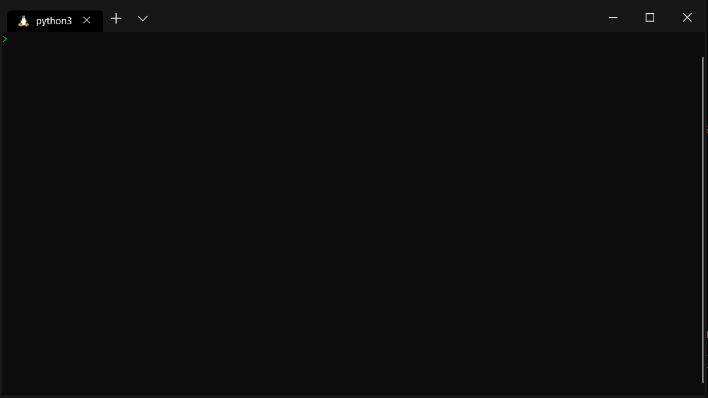

# FluentArgs: Fluent Arguments Parsing for .NET
[](https://dev.azure.com/benjaminmeier70/PipelinePlayground/_build/latest?definitionId=3&branchName=master)

FluentArgs is an easy-to-use library that provides command line argument parsing and also generating a
simple help for users of the command line tool.

# Why FluentArgs?

The API is optimized to be as readable as possible. Therefore, anyone can learn how to use this library
in just a few minutes.



# How to install
TODO

# Example: Parse simple arguments and flags

```csharp
namespace Example
{
    using FluentArgs;
    using System;
    using System.Threading.Tasks;

    class Program
    {
        public static Task Main(string[] args)
        {
            return FluentArgsBuilder.New()
                .DefaultConfigs()
                .Parameter("-i", "--input").IsRequired()
                .Parameter("-o", "--output").IsRequired()
                .Parameter<ushort>("-q", "--quality")
                    .WithValidation(n => n >= 0 && n <= 100)
                    .IsOptionalWithDefault(50)
                .Call(quality => outputFile => inputFile =>
                {
                    /* ... */
                    Console.WriteLine($"Convert {inputFile} to {outputFile} with quality {quality}...");
                    /* ... */
                    return Task.CompletedTask;
                })
                .ParseAsync(args);
        }
    }
}

```

It is possible to add some meta-information to the parameters (e.g. description and examples):
```csharp
namespace Example
{
    using FluentArgs;
    using System;
    using System.Threading.Tasks;

    class Program
    {
        public static Task Main(string[] args)
        {
            return FluentArgsBuilder.New()
                .DefaultConfigsWithAppDescription("An app to convert png files to jpg files.")
                .Parameter("-i", "--input")
                    .WithDescription("Input png file")
                    .WithExamples("input.png")
                    .IsRequired()
                .Parameter("-o", "--output")
                    .WithDescription("Output jpg file")
                    .WithExamples("output.jpg")
                    .IsRequired()
                .Parameter<ushort>("-q", "--quality")
                    .WithDescription("Quality of the conversion")
                    .WithValidation(n => n >= 0 && n <= 100)
                    .IsOptionalWithDefault(50)
                .Call(quality => outputFile => inputFile =>
                {
                    /* ... */
                    Console.WriteLine($"Convert {inputFile} to {outputFile} with quality {quality}...");
                    /* ... */
                    return Task.CompletedTask;
                })
                .ParseAsync(args);
        }
    }
}

```

# Example: Parse positional and remaining arguments

# Example: Parse conditional arguments / commands

# Example: Help

# Example: Advanced configuration


